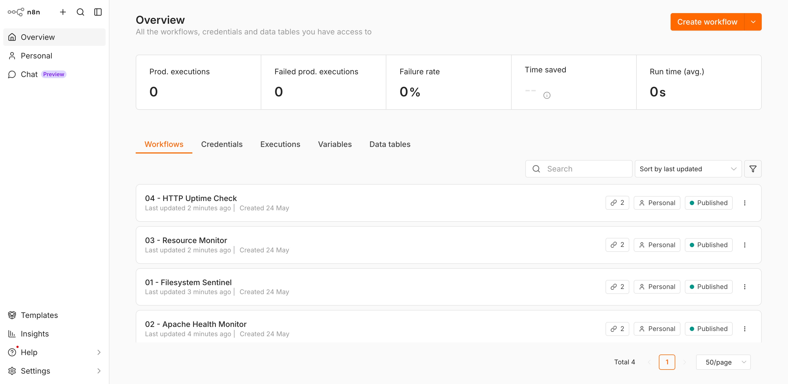
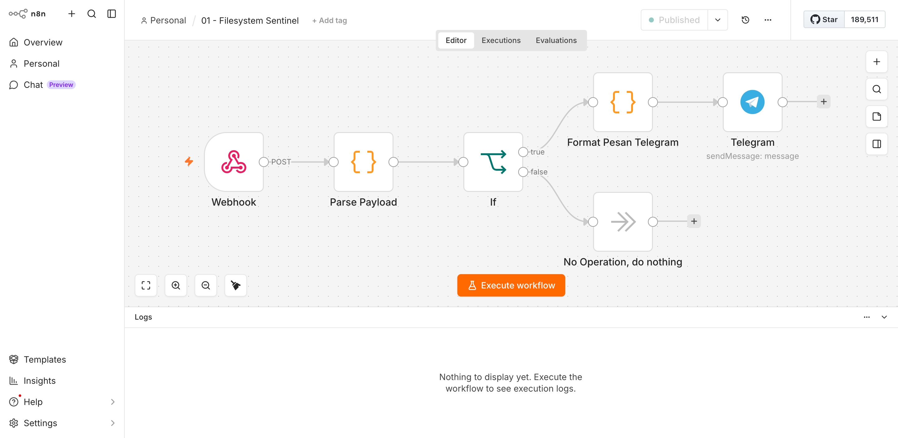
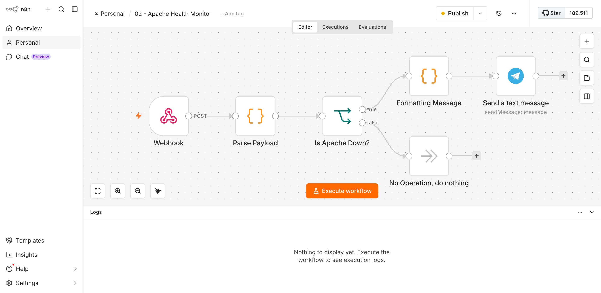
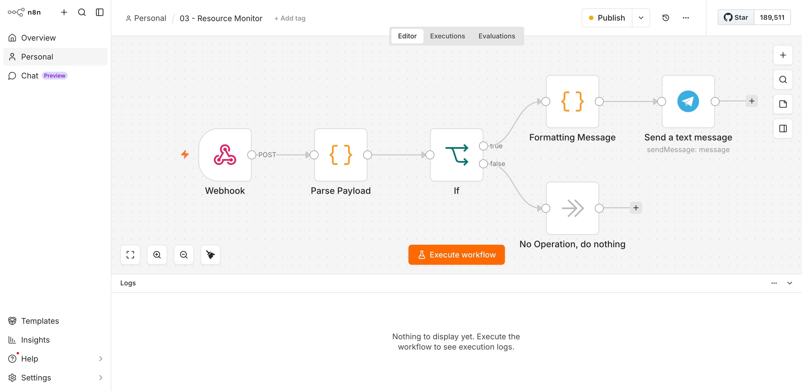

# 🛡️ n8n-bastion

**VPS Watchdog — Intrusion Detection & Infrastructure Monitoring via n8n**

[](LICENSE)
[](https://n8n.io)
[](https://nodejs.org)
[](https://laravel.com)

A collection of bash scripts and n8n workflows that turn your VPS into a self-monitoring server — detecting intrusions, recovering from failures, and sending real-time Telegram alerts.

Born from a real production incident where a Laravel application was compromised with obfuscated PHP backdoors and malicious `.htaccess` modifications. Built to make sure it never goes undetected again.

---

## How It Works

Unlike n8n's built-in Execute Command node (disabled by default in n8n 2.0+), n8n-bastion uses a **Bash + Cron → Webhook** architecture:

```
┌─────────────────────────────────────────────────────────────────┐
│  VPS                                                            │
│                                                                 │
│  Cron                                                           │
│   ├── */5  * * * *  sentinel.sh       ──────────────────────►  │
│   ├── *    * * * *  apache-monitor.sh ──────────────────────►  │──► n8n Webhook ──► Telegram
│   ├── */15 * * * *  resource-monitor.sh ────────────────────►  │
│   └── */2  * * * *  uptime-check.sh  ──────────────────────►   │
│                                                                 │
└─────────────────────────────────────────────────────────────────┘
```

**Bash scripts** handle the heavy lifting — filesystem scanning, service checks, resource monitoring. They run via cron and POST results to n8n only when something needs attention.

**n8n workflows** handle notification logic — receiving the webhook payload, evaluating conditions, and sending formatted Telegram alerts.

This keeps n8n lightweight: no persistent polling, no shell access required from n8n, no Execute Command node needed.

---

## Watchdogs

| # | Script | Trigger | What It Does |
|---|--------|---------|--------------|
| 1 | `sentinel.sh` | Every 5 min | Runs [laravel-scalpel](https://github.com/hryagstn/laravel-scalpel) to detect obfuscated PHP backdoors, rogue files, and malicious `.htaccess` directives |
| 2 | `apache-monitor.sh` | Every 1 min | Checks Apache status, auto-restarts if down, reports outcome |
| 3 | `resource-monitor.sh` | Every 15 min | Alerts when disk or RAM exceeds configured threshold |
| 4 | `uptime-check.sh` | Every 2 min | Confirms application-level downtime with a 30s double-check before alerting |

---

## Screenshots

| n8n Dashboard | Filesystem Sentinel |
|:---:|:---:|
|  |  |

| Apache Monitor | Resource Monitor |
|:---:|:---:|
|  |  |

---

## Prerequisites

| Component | Minimum | Recommended |
|-----------|---------|-------------|
| OS | Ubuntu 20.04 | Ubuntu 22.04+ |
| RAM | 1 GB | 2 GB |
| Web Server | Apache 2.4+ | Apache 2.4+ |
| PHP | 8.1 | 8.2+ |
| Laravel | 10.x | 12.x / 13.x |
| Node.js | 24.x LTS | 24.x |
| n8n | 2.0+ | Latest |
| curl | Any | Any |
| python3 | 3.8+ | 3.10+ |

---

## Quick Start

```bash
# 1. Clone the repository
git clone https://github.com/hryagstn/n8n-bastion.git
cd n8n-bastion

# 2. Install Node.js 24 LTS and n8n
curl -fsSL https://deb.nodesource.com/setup_24.x | sudo -E bash -
sudo apt-get install -y nodejs
sudo npm install n8n -g

# 3. Set up directories
sudo mkdir -p /opt/n8n-bastion/{scripts,logs}
sudo chown -R $USER:$USER /opt/n8n-bastion

# 4. Configure environment
cp config/bastion.env.example /opt/n8n-bastion/bastion.env
nano /opt/n8n-bastion/bastion.env

# 5. Start n8n as a service
sudo cp config/n8n.service.example /etc/systemd/system/n8n.service
sudo nano /etc/systemd/system/n8n.service
sudo systemctl daemon-reload && sudo systemctl enable n8n && sudo systemctl start n8n

# 6. Install scripts
cp scripts/*.sh /opt/n8n-bastion/scripts/
chmod +x /opt/n8n-bastion/scripts/*.sh

# 7. Install laravel-scalpel
cd /path/to/your/laravel-project
composer require hryagstn/laravel-scalpel --dev
php artisan vendor:publish --tag=scalpel-config
php artisan scalpel:baseline
```

Then follow [docs/setup.md](docs/setup.md) to create the n8n workflows and configure cron.

---

## Importing Workflows

The `workflows/` directory contains ready-to-import n8n workflow JSON files.

```
n8n UI → Overview → Workflows → Import → select JSON file
```

After importing each workflow:
1. Update the **Telegram** node with your Chat ID
2. Assign your credentials to the **Webhook** and **Telegram** nodes
3. Click **Publish**
4. Copy the **Production URL** from the Webhook node → update `bastion.env`

---

## Project Structure

```
n8n-bastion/
├── config/
│   ├── bastion.env.example       # Environment configuration template
│   └── n8n.service.example       # systemd service template
├── scripts/
│   ├── sentinel.sh               # Filesystem intrusion detection
│   ├── apache-monitor.sh         # Apache health check + auto-restart
│   ├── resource-monitor.sh       # Disk & RAM monitoring
│   └── uptime-check.sh           # HTTP uptime check
├── workflows/
│   ├── 01-filesystem-sentinel.json
│   ├── 02-apache-health-monitor.json
│   ├── 03-resource-monitor.json
│   └── 04-http-uptime-check.json
├── docs/
│   ├── setup.md                  # Full setup guide
│   ├── telegram-setup.md         # Telegram bot setup guide
│   └── screenshots/              # Dashboard and alert screenshots
└── examples/
    └── paketlebaranku/           # Real-world case study
        └── README.md
```

---

## Security

- n8n listens on `127.0.0.1` only — not exposed to the public internet
- All webhook requests are authenticated via `X-Bastion-Secret` header
- Bash scripts source credentials from a local file outside the repository
- No sensitive values are stored in the workflow JSON files

Access the n8n UI via SSH tunnel from your local machine:

```bash
ssh -fNL 5678:127.0.0.1:5678 YOUR_USER@YOUR_VPS_IP
# Then open: http://localhost:5678
```

---

## Related

- [laravel-scalpel](https://github.com/hryagstn/laravel-scalpel) — The filesystem intrusion scanner powering Watchdog 1

---

## License

MIT License — see [LICENSE](LICENSE) for details.
